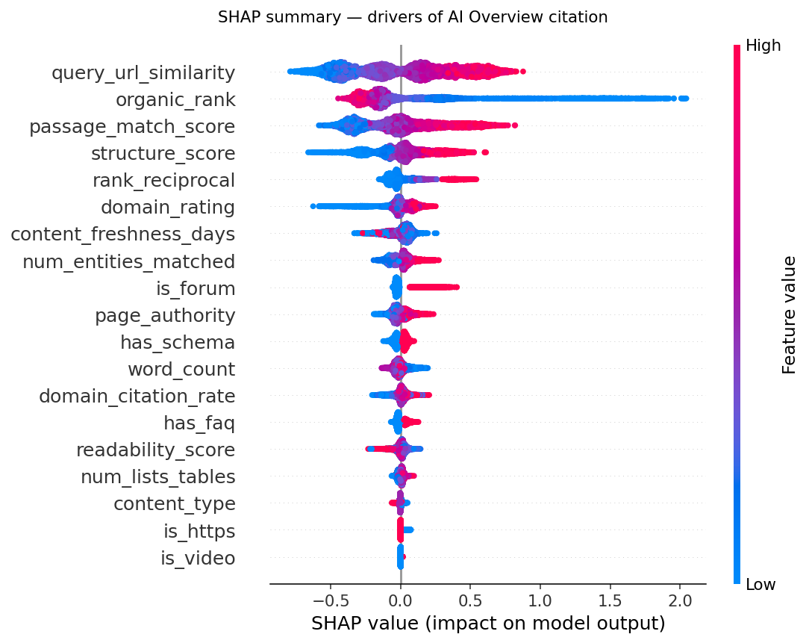
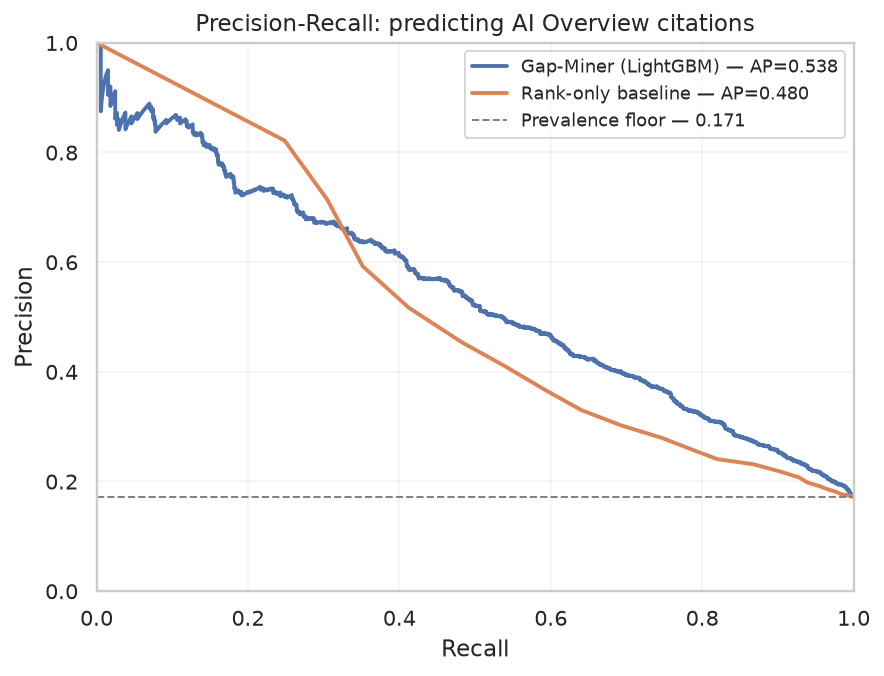

# AIO Gap-Miner

**Predicting — and explaining — which URLs get cited in Google AI Overviews.**

Google's AI Overviews (and ChatGPT, Perplexity, Claude) answer informational
queries at the top of the page and cite a *handful* of sources. If your URL
isn't in that citation set, your ranking position barely matters — the click
never happens. This project trains supervised models over **(query, URL)** pairs
to predict which candidate URLs get cited, and uses **SHAP** to explain *why* —
turning "GEO" from folklore into a measurable, auditable signal.

> Data Analytics & AI capstone. The committed sample data is **synthetic** so the
> whole pipeline runs for anyone with zero data access; real labelled AI Overview
> citation data plugs into the same schema.

**End-to-end pipeline:** `SQLite / SQLAlchemy ETL → EDA (seaborn) → inferential
statistics → feature engineering → GroupKFold CV (Logistic Regression + LightGBM)
→ evaluation → TreeSHAP → Tableau hand-off.`

---

## The framing (and why each choice)

The unit of observation is one **(query, URL)** pair — one row per candidate URL
for a query, labelled `cited = 1` if that URL appeared in the AI Overview
citation set, else `0`.

| Decision | Choice | Why |
|---|---|---|
| Task | Binary classification over (query, URL) pairs | Citation is a per-candidate yes/no |
| Models | **Logistic Regression** + **LightGBM** | Transparent linear baseline vs non-linear gradient-boosted trees |
| Validation | **GroupKFold** grouped by `query_id` | Labels are *query-relative* → no query may leak across the train/test split |
| Metric | **PR-AUC** (average precision) | Positives are rare (~17%) and query-relative; ROC-AUC and accuracy flatter the model |
| Baseline | **rank-only** heuristic (`1/organic_rank`) | The bar to beat: does learning add anything over "just trust the ranking"? |
| Explainability | **TreeSHAP** | Exact per-feature attribution — the "why" a black box or a rules engine can't give |

The single most important methodological point is **grouped cross-validation**.
Because whether a URL is cited depends on the *other* candidates for the same
query, rows from one query must never sit on both sides of the split. GroupKFold
on `query_id` guarantees leakage-safe, out-of-fold evaluation, and both models
are scored on the *same* folds for an apples-to-apples comparison.

---

## Do cited and non-cited URLs actually differ? (inferential statistics)

Before modelling, the A/B-testing question on observational data: treat *cited*
vs *not cited* as two groups and test where they diverge. Features are skewed and
non-normal, so we use the **Mann-Whitney U** test and report a rank-biserial
**effect size** (not just a p-value).

| Signal | Median (cited) | Median (not) | p-value | Effect size |
|---|---|---|---|---|
| `organic_rank` | 6.0 | 12.0 | ~1e-182 | 0.51 (large) |
| `query_url_similarity` | 0.70 | 0.54 | ~1e-176 | 0.51 (large) |
| `passage_match_score` | 0.73 | 0.55 | ~1e-144 | 0.46 (medium) |
| `domain_rating` | 70.4 | 61.4 | ~1e-79 | 0.34 (medium) |
| `structure_score` | 0.56 | 0.48 | ~1e-76 | 0.33 (medium) |

Cited URLs rank higher, match the query more closely, and are more structured —
all significant with meaningful effect sizes.

---

## Results (synthetic demonstration data)

`400 queries · 7,361 (query, URL) pairs · 17.1% cited` — PR-AUC reported as
per-fold **mean ± std** on the shared GroupKFold splits.

| Model | PR-AUC | ROC-AUC | Precision@k |
|---|---|---|---|
| **Gap-Miner (LightGBM)** | 0.572 ± 0.018 | 0.815 | 0.591 |
| **Logistic Regression** | 0.585 ± 0.015 | 0.828 | 0.612 |
| Rank-only heuristic | 0.483 ± 0.009 | 0.757 | 0.526 |
| Random / prevalence | 0.171 | 0.500 | — |

Both learned models beat a *strong* rank-only heuristic by **~10 PR-AUC points**
and lift per-query precision@k. On this synthetic data the label is close to
linear in the engineered features, so logistic regression is very competitive;
gradient boosting's edge typically grows with the non-linear interactions present
in real citation data. LightGBM is carried forward for SHAP because tree
attributions are exact.

### Why the model wins: SHAP



The top drivers of citation are **query↔passage semantic match**, **content
structure** (schema / FAQ / lists & tables), and **domain citation history** — on
top of, not instead of, ranking position. That is the GEO thesis made measurable:
*structured, on-topic pages get cited beyond what their SERP position predicts.*



*(All figures are regenerated by `scripts/run_pipeline.py`.)*

---

## Quickstart

```bash
# 1. Install (editable, src layout)
python -m venv .venv && source .venv/bin/activate
pip install -e .

# 2. Generate the synthetic sample dataset
python scripts/generate_sample_data.py

# 3a. Run the full pipeline (ETL -> stats -> CV -> SHAP; figures to reports/figures/)
python scripts/run_pipeline.py

# 3b. …or open the narrative notebook
jupyter lab notebooks/01_gap_miner_baseline.ipynb

# 4. Export the Tableau data source
python scripts/export_tableau.py
```

Run the tests:

```bash
pip install pytest && pytest -q
```

### Run on real data

Drop a CSV with the columns in `EXPECTED_COLUMNS` (see `src/aio_gap_miner/data.py`)
into `data/raw/`, then:

```bash
python scripts/run_pipeline.py --data data/raw/your_citation_data.csv
```

No code changes — the pipeline is schema-driven.

---

## Repository layout

```
aio-gap-miner/
├── src/aio_gap_miner/         # installable package
│   ├── config.py              # paths, feature lists, LightGBM params (single source of truth)
│   ├── data.py                # (query, URL) schema, synthetic generator, loaders
│   ├── database.py            # SQLAlchemy/SQLite ETL + analytical SQL
│   ├── features.py            # engineered features + model-matrix builder
│   ├── stats.py               # descriptive + inferential statistics, seaborn plots
│   ├── model.py               # GroupKFold CV: LightGBM + Logistic Regression
│   ├── evaluate.py            # PR-AUC, baselines, precision@k, model comparison, plots
│   └── explain.py             # TreeSHAP values + plots
├── notebooks/
│   └── 01_gap_miner_baseline.ipynb   # the narrative, with embedded outputs
├── scripts/
│   ├── generate_sample_data.py       # build the committed sample
│   ├── build_database.py             # standalone ETL step
│   ├── run_pipeline.py               # end-to-end CLI
│   ├── export_tableau.py             # write the Tableau data source
│   └── build_notebook.py             # regenerate the notebook from source
├── tableau/                   # Tableau data source + dashboard spec
├── tests/                     # schema / leakage / ETL / stats / comparison guards
├── data/sample/               # synthetic sample dataset (committed)
└── reports/figures/           # generated plots
```

---

## Tech stack

`Python · pandas · SQL (SQLAlchemy / SQLite) · seaborn · matplotlib · scipy ·
scikit-learn · LightGBM · SHAP · Tableau · Git`

## Code quality

Linting, formatting, and dead-code / dependency checks are wired in and pass
clean:

```bash
pip install -e ".[dev]"
ruff check .        # lint (pyflakes, isort, pyupgrade, bugbear) — passes
ruff format .       # formatting
deptry .            # unused/missing dependencies — passes
pre-commit install  # run all checks automatically on every commit
```

Config lives in `pyproject.toml` (`[tool.ruff]`, `[tool.deptry]`) and
`.pre-commit-config.yaml`.

## Feature set

Signals per (query, URL) pair — SERP + on-page crawl:

- **Ranking:** `organic_rank`, `rank_reciprocal` *(engineered)*
- **Authority:** `domain_rating`, `page_authority`, `domain_citation_rate`
- **Relevance:** `query_url_similarity`, `passage_match_score`, `num_entities_matched`
- **Structure / extractability:** `has_schema`, `has_faq`, `num_lists_tables`, `structure_score` *(engineered)*
- **Content:** `word_count`, `readability_score`, `content_freshness_days`, `content_type`
- **Source type:** `is_forum`, `is_video`, `is_https`

## Roadmap

1. **Real labels** — swap the synthetic sample for a labelled AI Overview
   citation set (same schema).
2. **Richer features** — real embeddings for query↔passage similarity, NER-based
   entity coverage, SERP-feature flags, Core Web Vitals.
3. **Probability calibration** — isotonic/Platt on top of the ranker for an
   absolute "citation likelihood" score.
4. **Gap reports** — per-page SHAP turns the model into a prescriptive tool: for a
   citation you *don't* hold, it names the specific levers (add FAQ schema,
   tighten the answer passage, raise topical coverage) to close the gap.

## License

MIT — see [LICENSE](LICENSE).
